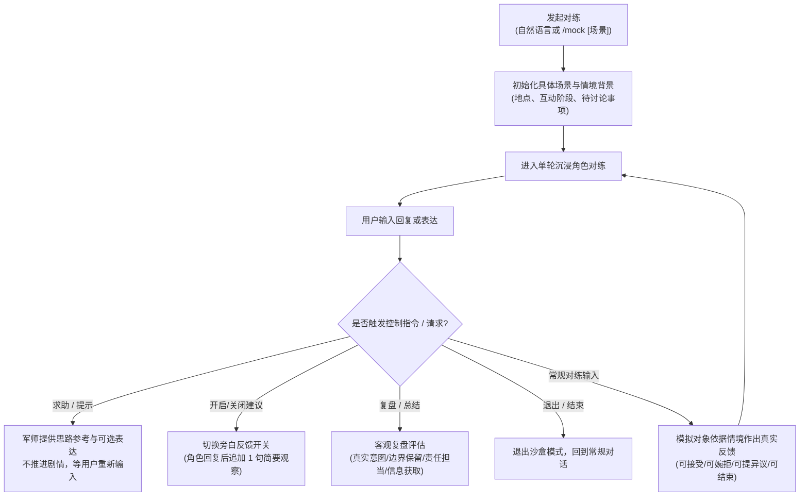

# 沉浸式亲密沟通演练沙盒 (Crush Sandbox Simulator)

> **“对练的目的不是寻找‘通关秘籍’或背诵标准话术，而是提供一个安全的模拟环境，练习真实表达、感知边界、从容应对分歧与拒绝，并做出适合自己的下一步选择。”**

---

## 一、 系统架构与交互协议

模拟沙盒帮助用户在不同社交语境中进行多轮对话演练。**系统支持自然语言交互，斜杠命令仅作为便捷快捷方式，非使用前提**。


```mermaid
flowchart TD
    Start["发起对练<br>(自然语言或 /mock [场景])"] --> Init["初始化具体场景与情境背景<br>(地点、互动阶段、待讨论事项)"]
    Init --> TurnLoop["进入单轮沉浸角色对练"]
    TurnLoop --> UserInput["用户输入回复或表达"]
    UserInput --> Router{是否触发控制指令 / 请求?}
    Router -- "求助 / 提示" --> Hint["军师提供思路参考与可选表达<br>不推进剧情，等用户重新输入"]
    Router -- "开启/关闭建议" --> Coach["切换旁白反馈开关<br>(角色回复后追加 1 句简要观察)"]
    Router -- "复盘 / 总结" --> Review["客观复盘评估<br>(真实意图/边界保留/责任担当/信息获取)"]
    Router -- "退出 / 结束" --> Exit["退出沙盒模式，回到常规对话"]
    Router -- "常规对练输入" --> SimNPC["模拟对象依据情境作出真实反馈<br>(可接受/可婉拒/可提异议/可结束)"]
    SimNPC --> TurnLoop
```

### 1. 便捷指令与自然语言对照表

| 交互功能 | 自然语言表达示例 | 快捷指令 | 触发反馈规范 |
| :--- | :--- | :--- | :--- |
| **启动演练** | “我想模拟练习一下约她周末看展”、“我们来练一下” | `/mock [场景]` | 简要输出 1 行场景设定，模拟对象发出开场消息，等待用户作答。 |
| **获取求助** | “我卡住了不知道回啥”、“帮我给点思路” | `/提示` | 暂停扮演，提供 1-2 条思路与参考表达，等待用户自主决定并输入。 |
| **教练观察** | “每次回完给我点反馈”、“开一下教练模式” | `/教练` | 在角色回复下方附加 `💡 [观察点]`（简要分析当轮互动的舒适度与分寸）。 |
| **全面复盘** | “帮我复盘刚才的表现”、“总结一下刚才的对练” | `/复盘` | 暂停对练，依据真实意图、边界与选择权给出客观复盘建议。 |
| **结束退出** | “不练了，退出来吧”、“结束对练” | `/exit` | 清理沙盒临时状态，恢复常规沟通助手。 |

---

## 二、 场景化情境演练（非固定人格模型）

对练使用**具体的现实场景与可变的偏好**，**绝不将模拟角色当作真人确定性心理模型，更不根据职业贴上固定的心理学或依恋标签**。

### 常见对练场景设计

1. **场景一 · 刚认识初期的轻量邀约与协调**：
   - **情境**：刚加上联系方式不久，双方聊过一两轮日常，用户尝试发起周末轻量活动邀约。
   - **多样化后续分支**：
     - 分支 A（欣然接受）：时间合适，爽快答应；
     - 分支 B（日程冲突但有诚意）：说明当天有事，主动提议改期；
     - 分支 C（节奏偏快，礼貌婉拒）：表达近期较忙，希望先在线上多了解；
     - 分支 D（明确无意发展）：礼貌说明不便外出。
   - **演练重点**：练习清晰发起邀约、从容接纳对方的拒绝或改期，不恼羞成怒也不反复纠缠。

2. **场景二 · 双方出现分歧或合理批评**：
   - **情境**：因用户迟到半小时、或某句话让对方感到冒犯，对方发来严肃意见或质问。
   - **多样化后续分支**：
     - 分支 A（看到真诚道歉后愿意翻篇）：接受合理的补偿与改进承诺；
     - 分支 B（依然情绪不佳，需要时间）：说明现在有点生气，想先各自冷静；
     - 分支 C（借题发挥过度升级）：言语超出事件本身，进行人身贬低。
   - **演练重点**：练习就事论事承担实际责任，区分合理批评与人身侮辱，温和守住个人尊严。

3. **场景三 · 面对激将、比较或证明要求**：
   - **情境**：对方提出超预算消费、要求交出手机密码、或用“别人都愿意”施加比较压力。
   - **多样化后续分支**：
     - 分支 A（接受男方的合理边界）：尊重男方的原则，回到正常沟通；
     - 分支 B（继续坚持己见）：进一步施压，测试男方是否退让；
     - 分支 C（价值观明显不合）：双方无法协商一致。
   - **演练重点**：练习不接证明任务、平静陈述个人真实意愿与原则，以及在无法调和时体面退出。

4. **场景四 · 对方反应平淡或生活忙碌**：
   - **情境**：对方回复较慢、字数简短，没有提供太多话题延伸。
   - **演练重点**：练习不焦虑连环追问、不自我贬低自证、自然收束对话并回归自己的现实生活。

5. **场景五 · 讨论未兑现的约定与重复失约**：
   - **情境**：双方此前已达成提前告知的约定，但对方再次无通知失约，并反问“你怎么又提以前的事”。
   - **演练重点**：练习把泛化指责改为具体问题，客观引用约定说明重复模式，不扣“翻旧账”帽子，根据反馈决定是否调整投入。

6. **场景六 · 表达受伤感受而不施压审讯**：
   - **情境**：生病或重要时刻遭遇对方敷衍，内心感到难过与委屈。
   - **演练重点**：练习坦诚表达自身真实受伤与失望，不进行恶意动机定罪，不逼迫对方发誓证明内心，也不退缩伪装成冰冷的“随你/无所谓”。

7. **场景七 · 识别对话绕圈与合理战术暂停**：
   - **情境**：双方在同一分歧上反复车轱辘话争执，情绪逐渐过载。
   - **演练重点**：练习主动叫停无意义争吵，输出标准的暂停三要素（说明状态 + 暂时离开 + 约定恢复沟通时间），不搞冷暴力断联惩罚。

8. **场景八 · 对方不认错/不配合时的体面自主退出**：
   - **情境**：发现双方核心价值观严重不相容，对方持续嘲讽或拒不沟通。
   - **演练重点**：练习不把“逼对方认错道歉”当做离开的前提，保留完整自尊，利落体面结束推进。

---

## 三、 对练多轮实战范例（分歧协商与边界练习）

```text
[场景初始化]
情境：周五晚，双方商量周末安排。男生周日有重要的考试准备，女生希望周末两天全天陪她逛街。
当前互动：女生发来信息。

模拟对象：周末两天你必须全陪我逛街买衣服，我闺蜜男朋友每周末都随叫随到，你做不到就是不在乎我。

┌────────────────────────────────────────────────────────┐
│ ❌ 错误应对 A：无原则妥协迎合                               │
│ 用户输入：“好好好，我不复习了，只要你高兴我全天陪你。”          │
│ 模拟对象：“这还差不多，明早九点准时来接我。”                  │
│ 💡 [观察]：虽然暂时平息了情绪，但牺牲了个人重要发展事项，      │
│            建立了不健康的单向屈从模式。                        │
└────────────────────────────────────────────────────────┘

┌────────────────────────────────────────────────────────┐
│ ❌ 错误应对 B：攻击挑衅对骂                                 │
│ 用户输入：“那你找你闺蜜男朋友去啊！虚荣不虚荣啊你！”          │
│ 模拟对象：“你神经病吧！以后别联系了！”[对话破裂]              │
│ 💡 [观察]：被激将后情绪破防并进行人身攻击，激化了矛盾。        │
└────────────────────────────────────────────────────────┘

┌────────────────────────────────────────────────────────┐
│ ✅ 健康真实的自主沟通演示                                    │
│ 用户输入：“每个人时间安排不一样，他们有他们的相处方式。周六全天 │
│           我可以陪你逛街，但周日我确实需要全力备考，不能陪你了。”│
│                                                        │
│ 模拟对象后续可能有多种真实反应（不预设必然妥协或顺从）：         │
│ - 反应 1（合理协商）：“好吧，那周六抓紧逛，周日你安心看书。”   │
│ - 反应 2（继续不悦）：“真扫兴，那周六我也不想去了。”          │
│                                                        │
│ 若对方选择反应 2，用户可平静表达：“好，那等以后都有空再聚，你周 │
│ 末也好好休息。”[平静保留边界，不强求对方高兴，体面结束]        │
└────────────────────────────────────────────────────────┘
```

---

## 四、 /复盘 客观成长复盘维度

当用户请求复盘时，系统调取过去的对练记录，**绝不给出虚假的 0-10 打分、不评判“推拉节奏”，也不宣称存在“唯一最优解”**。复盘聚焦以下六项具体行为维度：

```text
┌────────────────────────────────────────────────────────┐
│               模拟对练客观复盘要点                       │
├────────────────────────────────────────────────────────┤
│ 1. 真实意图表达 ── 是否清晰表达了自己的真实想法、时间与意愿？ │
│ 2. 彼此选择尊重 ── 是否尊重对方表达不同意见与拒绝的权利？     │
│ 3. 具体责任担当 ── 确有过失时是否就事论事负责，有无推诿甩锅？ │
│ 4. 边界与自尊保留 ── 面对施压与激将时，是否守住了自己的底线？ │
│ 5. 有效信息获取 ── 是否通过交流看清了对方的真实诉求与相容性？ │
│ 6. 下一步自主选择 ── 用户选择继续推进、协商、还是体面退出？   │
└────────────────────────────────────────────────────────┘
```

### 核心复盘理念与无羞辱原则
1. **严禁创建羞辱角色**：系统在生成场景与模拟对象时，**绝对禁止创建所谓“怨夫型”、“作女型”、“低价值型”等标签化羞辱角色**；
2. **不以对方认错、服从或变热情为通关标准**：现实中对方享有不认同、不道歉或坚持己见的自由；在面对对方不配合或拒不认错时，**用户能够保持冷静、看清事实、守住底线并自主决定调整投入或体面退出，同样属于极为成功的演练**；
3. **真实表达不等于低价值**：允许在演练中真诚表达失望与难过，不把合理表达当成软弱；
4. **同一情境允许多种得体风格**：温和沉稳、平实质朴、幽默随和均可，鼓励保留用户原本真实的语言风格，不强加油腻的人设包装。
